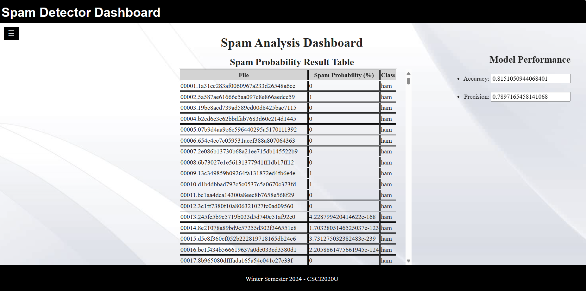
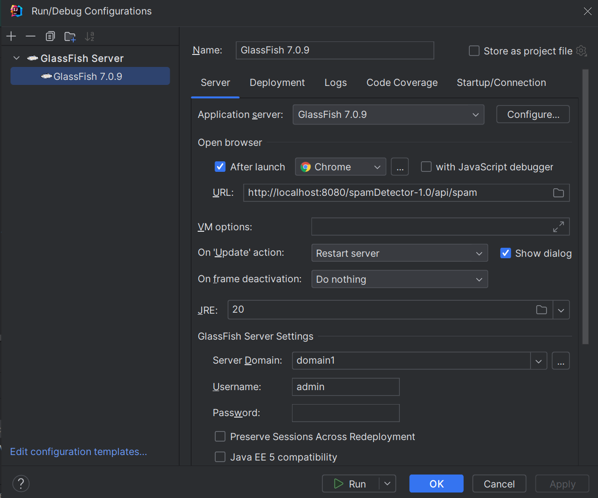
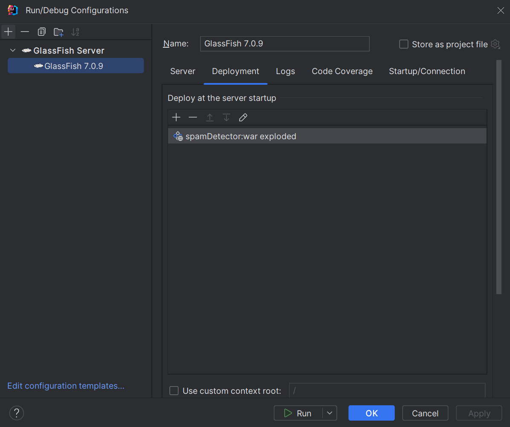
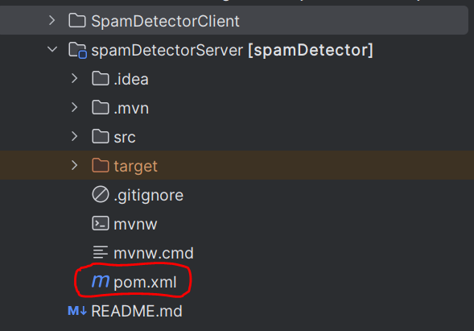

# Assignment 01 - Spam Detector

## Project Information
The project takes emails and goes over the emails and confirms whether the email is a spam or not. It does this by iteratimg over the email and checking for common occuring spam words or tendencies. We than take this and find the spam probability of these emails and display them in a table. We also find the accuracy and precision of identifiying these spam emails by dividing the number of correct guesses by the total number of emails, and the number of correct spam guesses divided by the number of all spam guesses, respectively.  

This is an image of our working project.  

Group Members:  
Yousaf Jan  
Sabaoon Mohammad Jamil  
Yoosuf Mohamed Kamal  

## Improvements
- We designed a side Navagation bar that opens and closes through the click of a button.
- We designed a scroller that minimizes the long list of emails making it easier to navigate through the data on the same page.
- We designed our web page so that it has a colour theme (white, black, grey) So that it looks more appealing.
- We designed our About page wby implenting a github button that uppon clicking takes you to the group members github page.
- Since NaN And infinite values create errors we skipped over them.

## How to run
[1] CLone the repository.  
[2] Edit Glass Fish Configurations.  
    - Select Local Glass Fish server.  
    - Set URL to match image below.  
    - Set Domain to domain1  
    - Set JRE to 20.0.2  
      
    - Under Deployment add artifact: spamDetector:war exploded.  
    - Select ok to make changes.  
      
[3] Run your Glass Fish server.  
[4] Open your index.html file in a browser and wait for table to populate (This may take a while).  

### Possible run error fixes
- If artifact: spamDetector:war exploded does not exist right click on your pom.xml file and click on add as amaven project.  
  
if your pom.xml file is added as a maven project the file will appear as a blue m.  
After that add the artifact spamDetector:war exploded.  
## Resources
- [W3schools](https://www.w3schools.com/)
- [Wikipedia_1](https://en.wikipedia.org/wiki/Bag-of-words_model)
- [Wikipedia_2](https://en.wikipedia.org/wiki/Naive_Bayes_spam_filtering)
